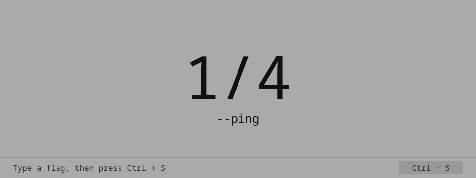
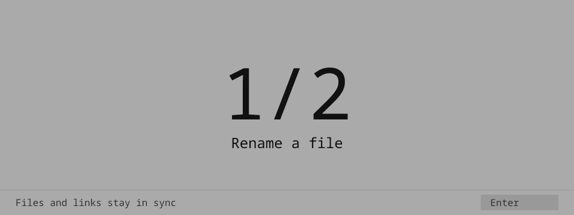
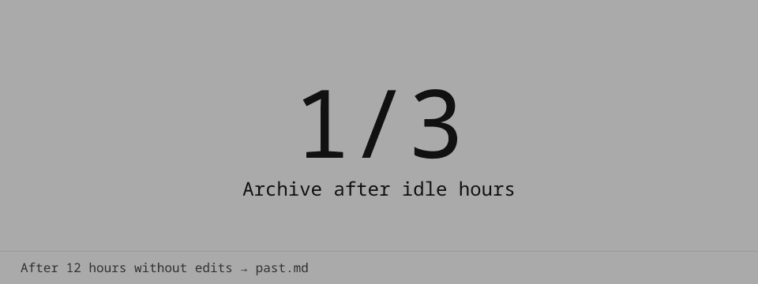
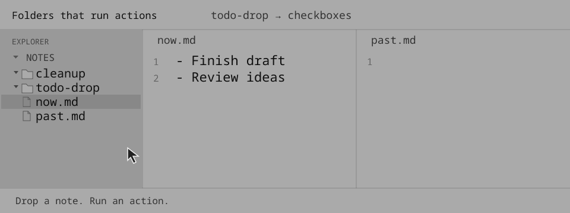
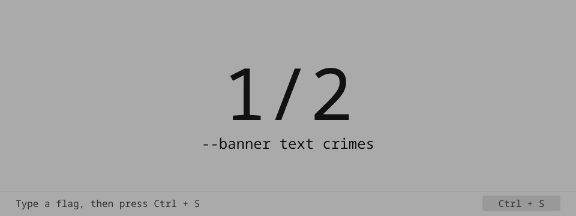
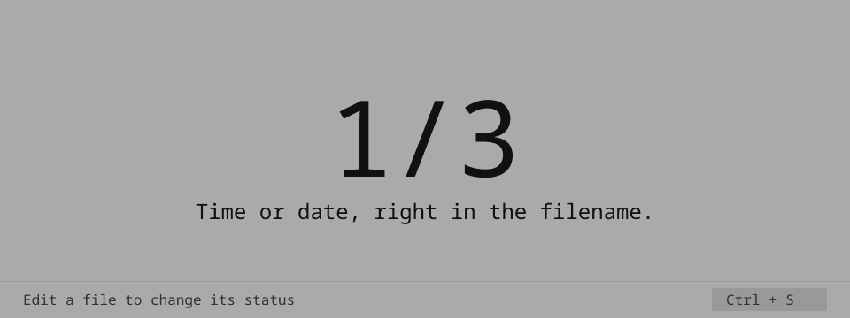
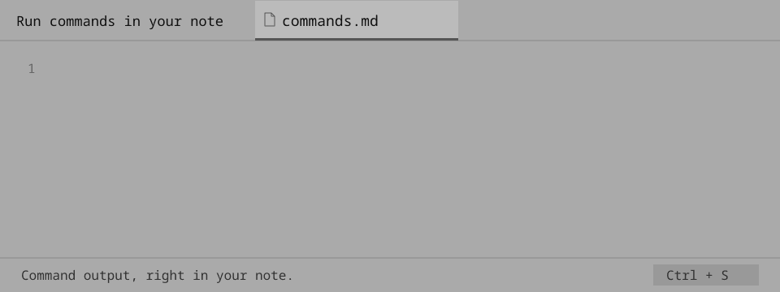

# D(a)emon Lucy — a modular notes manager

Your notes are just files. Use any editor you like. No editor plugins. Git is your cloud.

Lucy monitors your note folder. Every time you edit something, it runs modules on that file.


#### Usage

Use Unix-style flags in your note to run commands.

Write a command in your note and save it (`Ctrl+S`). Lucy runs the modules and writes the output directly into the note.

### Modules

**Basic modules (loaded by default):**

- `sys`: writes runtime debug information, event details, and manual help text.<br>
  
- `linker`: creates symlinks for active notes, and keeps file path markdown links in sync with note moves.<br>
  
- `archive`: moves idle note text into dated history or separate archive files, keeping the working note clear.<br>
  
- `dropdir`: runs actions when you drop notes into configured folders.<br>
  
- `renamer`: date renames scratch files when you need a quick note but do not know how to name it yet.<br>
  
- `banner`: inserts ASCII banner text or date banners into notes.<br>
  
- `formatter`: formats note text, including todo list conversion and blank-space padding.<br>
  
- `graph`: creates graph blocks for word and regex frequency.<br>
  
- `include`: renders complete files or matching source paragraphs inside notes.<br>
  
- `status`: updates standalone status filenames with dynamic tokens (time/date/git state, animations, prefixes).<br>
  
- `alias`: creates aliases for module args.
- `workspace`: initializes a default notes workspace with Git and systemd files.

**Integration modules:**
- `git`: syncs notes with a remote Git repository.
- `plasma_widget`: syncs Markdown notes with KDE Plasma note widgets ([see video](media/plasma_widget.mp4)).

**Modules (work in progress):**
- `cmd`: runs local commands and writes command output into notes. Not imported by default for security reasons.<br>
  
- `kdeconnect_sync`: sends note edit patches to your phone via KDE Connect (`kdeconnect-cli`) for near-real-time mobile mirror sync.
- `voice`: writes speech into notes using offline Vosk or online speech providers.
- `ai`: edits the current note from an inline prompt using local Codex.

See [CHEATSHEET.md](CHEATSHEET.md) for all arguments.

## Theory

### Flags system
You can use the same flag syntax in all three places:

1. Inside the note file (for per-note behavior)
2. In config.txt (global defaults)
3. At startup: ```python3 main_daemon.py --some-flag```

See [CHEATSHEET.md](CHEATSHEET.md) for all arguments.

### Get help with the System module

```--help``` for help message: 
```
* --mods: print loaded modules and their priorities
* --ping: send notification and rewrite command line to ++pong!
* --config: print config values that differ from defaults
* --man <name>: print one argument with description (example: --man mods or --man --mods)
```

```--mods``` to see loaded modules:
```
* sys (0)
* banner (10)
* todo (10)
* renamer (20)
* plasma_widget (30)
* cmd (50)
```

`--man <name>` shows help for a command or module.


### Sync your notes with Android
Run Lucy in [Termux](https://f-droid.org/packages/com.termux/). [Setup guide](#termux-setup).

Or use [GitSync app](https://github.com/ViscousPot/GitSync).

Btw [Markor](https://github.com/gsantner/markor) is a good text editor.


## Install

Warnings:
- **Turn on file auto-update in your text editor!**
- The project has only been tested on GNU/Linux-based distributions.
- macOS and Windows do not support daemon `opened` events.

1. Clone the repository:

```sh
git clone --depth 1 https://codeberg.org/vvindetta/demon_lucy && cd demon_lucy
```
   
2. Install dependencies:
```
python3 -m pip install -r requirements.txt
```

3. Edit the config file:
   - `config.txt` is a commented template. Uncomment and edit the lines you need.

### Manual run

Run daemon mode:
```text
python3 main_daemon.py --sys-config-path "/home/user/Notes/.lucy/config.txt"
```

Run oneshot mode (useful for scripts, scheduled runs):
```text
python3 main_oneshot.py \
  --oneshot-event opened \
  --oneshot-paths "/home/user/Notes/file.md" \
  --sys-modules git
```

### Systemd setup

The repo includes four units in `setup-systemd/`:
- [lucy-daemon.service](setup-systemd/lucy-daemon.service): always-running watcher for real-time note events.
- [lucy-daemon.timer](setup-systemd/lucy-daemon.timer): starts the daemon 30 seconds after the user service manager starts.
- [lucy-oneshot.service](setup-systemd/lucy-oneshot.service): single-run job (runs once and exits), used for periodic/manual tasks.
- [lucy-oneshot.timer](setup-systemd/lucy-oneshot.timer): schedule that starts `lucy-oneshot.service`.

Edit the service files and set your real repo, notes, and config paths.
Alternatively, use the files generated by the `workspace` module, but verify
all paths before enabling the services.

Services default paths:
- repo: `$HOME/demon_lucy`
- notes: `$HOME/Notes`
- config: `$HOME/Notes/.lucy/config.txt`

Move the units:
```bash
mkdir -p ~/.config/systemd/user; \
mv setup-systemd/lucy-daemon.service ~/.config/systemd/user/; \
mv setup-systemd/lucy-daemon.timer ~/.config/systemd/user/; \
mv setup-systemd/lucy-oneshot.service ~/.config/systemd/user/; \
mv setup-systemd/lucy-oneshot.timer ~/.config/systemd/user/
```

Reload and enable:
```bash
systemctl --user daemon-reload; \
systemctl --user enable --now lucy-daemon.timer; \
systemctl --user enable --now lucy-oneshot.timer
```

Useful checks:
```text
systemctl --user status lucy-daemon.service
systemctl --user status lucy-daemon.timer
systemctl --user status lucy-oneshot.timer
systemctl --user start lucy-oneshot.service
journalctl --user -u lucy-daemon.service -f
```

### Termux setup
Install these apps from F-Droid:
- [Termux](https://f-droid.org/packages/com.termux/): base shell/runtime.

Optional add-ons:
- [Termux:Boot](https://f-droid.org/packages/com.termux.boot/): place a startup script in `~/.termux/boot/` to run it automatically after boot.
- [Termux:Widget](https://f-droid.org/packages/com.termux.widget/): place a script in `~/.shortcuts/` to run it from the widget.
- [Termux:Tasker](https://f-droid.org/packages/com.termux.tasker/): place a script in `~/.termux/tasker/` to run it from Tasker automations.
- [Termux:API](https://f-droid.org/packages/com.termux.api/): enables `termux-job-scheduler`, `termux-wake-lock` and notifications.

Ready-to-use Termux scripts are in `setup-termux`:
- `lucy-daemon.sh`
- `lucy-oneshot.sh`
- `lucy-job-scheduler.sh`

Script default paths:
- repo: `$HOME/demon_lucy`
- notes: `$HOME/storage/shared/Notes`
- config: `$HOME/storage/shared/Notes/.lucy/config.txt`
- state/logs: `$HOME/.lucy`

Periodic mobile sync can also be registered through Android JobScheduler with [lucy-job-scheduler.sh](setup-termux/lucy-job-scheduler.sh). Use Termux:Boot for this mode only to register the persisted job after reboot.
