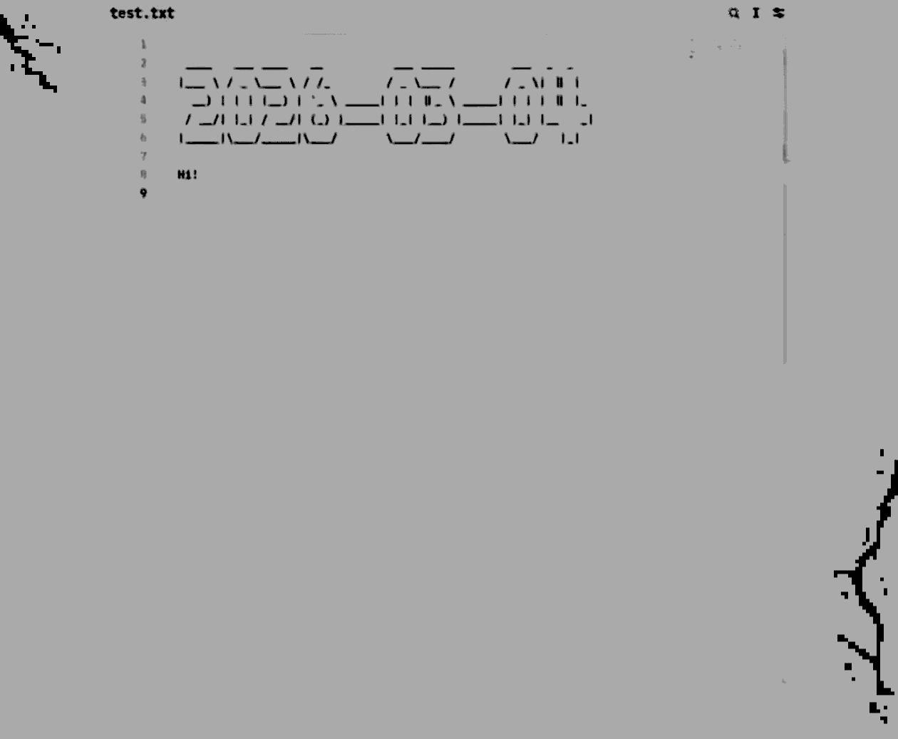

# D(a)emon Lucy — a modular notes manager

Your notes are just files. Use any editor you like. No editor plugins. Git is your cloud.

Lucy monitors your note folder. Every time you edit something, it runs modules on that file.



Lucy can read Unix-style flags written inside the note file.
It could be an execution command or some settings.

## Example of use
If `README.md` is one of your notes, you can write command flags directly inside it:

Rename `README.md` to `DONOTreadme.md`:

```--rename DONOTreadme.md```

Execute the terminal command (output will be written directly to the file):

```--cmd neofetch```


Then press ```CTRL+S``` - Lucy will detect the change and run the modules.

See [available modules](#modules).


### Sync your notes with Android
Run Lucy in [Termux](https://f-droid.org/packages/com.termux/). [Setup guide](#termux-setup).

Or use [GitSync app](https://github.com/ViscousPot/GitSync).

Btw [Markor](https://github.com/gsantner/markor) is a good text editor.

## Theory

### Flags system
You can provide flags in three places:

1. Inside the note file (for per-note behavior)
2. In config.txt (global defaults)
3. At startup: ```python3 main_daemon.py --some-flag```

See [CHEATSHEET.md](CHEATSHEET.md) for all arguments.

### System module

```--help``` for help message: 
```
* --mods: print loaded modules and their priorities
* --config: print config values that differ from defaults
* --man <name>: print one argument with description (example: --man mods or --man --mods)
```


```--mods``` to see loaded modules:
```
* sys (0)
* banner (10)
* todo (10)
* renamer (20)
* plasma_widget (30)
* cmd (50)
```

`--man flag_arg_here` for help with any flag argument.

```--man man``` :

```
* --man: print one argument with description (example: --man mods or --man --mods). (type=str, default=None)
```

### Modules

**Basic:**
- `sys`: writes runtime debug information, event details, and manual help text.
- `linker`: creates symlinks for active notes, and updates file path markdown links on move/rename.
- `archive`: automatically moves idle stale notes from the active note to a past/archive note, keeping one daily scratch note current and older text in history.
- `alias`: creates aliases for module args.
- `renamer`: date renames scratch files when you need a quick note but do not know how to name it yet.
- `banner`: inserts ASCII banner text or date banners into notes.
- `formatter`: formats note text, including todo list conversion and blank-space padding.
- `graph`: creates dynamic text or Markdown graph blocks for word and regex frequency.
- `workspace`: initializes a default notes workspace.

**Integrations:**
- `git`: syncs notes with a remote Git repository.
- `plasma_widget`: syncs Markdown notes with KDE Plasma note widgets ([see video](media/plasma_widget.mp4)).

**Experimental:**
- `dropdir`: handles moved files in configured drop directories. Useful for inbox/drop folders where a move should trigger temporary Lucy flags. Target modules must be selected in `--sys-modules`.
- `status`: updates standalone status filenames with dynamic tokens (time/date/git state, animations, prefixes).
- `cmd`: runs local commands and writes command output into notes. Not imported by default for security reasons.
- `kdeconnect_sync`: sends note edit patches to your phone via KDE Connect (`kdeconnect-cli`) for near-real-time mobile mirror sync.
- `voice`: replaces inline `--voice` with local Vosk transcription, stopping after speech ends.

See [CHEATSHEET.md](CHEATSHEET.md) for all arguments.

## Install

Tested on GNU/Linux based distros only.

1. Clone the repository:
```
git clone https://codeberg.org/vvindetta/demon_lucy && cd demon_lucy
```
   
2. Install dependencies:
```
pip install -r requirements.txt
```

3. Set up startup args (via config or CLI):
   - `config.txt` is a commented template. Uncomment and edit the lines you need.
   - At minimum, set `--sys-watch-paths "/home/user/Notes"`.
   - Or pass it directly at run time: `python3 main_daemon.py --sys-watch-paths "/home/user/Notes"`
   - Use `--sys-modules` to choose modules. Basic set: `alias workspace banner renamer linker formatter archive sys`.

#### **Turn on file auto-update in your text editor!**

### Manual run

Run the daemon:
```text
python3 main_daemon.py
```

Run oneshot tasks manually (useful for scripts, scheduled runs, and Termux/Tasker):
```text
python3 main_oneshot.py \
  --oneshot-event opened \
  --oneshot-paths "/home/user/Notes/file.md" \
  --sys-modules git
```

### Systemd setup

The repo includes three units in `setup-systemd/`:
- [lucy-daemon.service](setup-systemd/lucy-daemon.service): always-running watcher for real-time note events.
- [lucy-oneshot.service](setup-systemd/lucy-oneshot.service): single-run job (runs once and exits), used for periodic/manual tasks.
- [lucy-oneshot.timer](setup-systemd/lucy-oneshot.timer): schedule that starts `lucy-oneshot.service`.

Edit the service files and set your real repo path, config path, and oneshot target note.

Services default paths:
- repo: `$HOME/demon_lucy`
- notes: `$HOME/Notes`
- config (daemon): `$HOME/Notes/config.txt`

Link the units:
```text
mkdir -p ~/.config/systemd/user
ln -sf "$PWD/setup-systemd/lucy-daemon.service" ~/.config/systemd/user/lucy-daemon.service
ln -sf "$PWD/setup-systemd/lucy-oneshot.service" ~/.config/systemd/user/lucy-oneshot.service
ln -sf "$PWD/setup-systemd/lucy-oneshot.timer" ~/.config/systemd/user/lucy-oneshot.timer
```

Reload and enable:
```text
systemctl --user daemon-reload
systemctl --user enable --now lucy-daemon.service
systemctl --user enable --now lucy-oneshot.timer
```

Useful checks:
```text
systemctl --user status lucy-daemon.service
systemctl --user status lucy-oneshot.timer
systemctl --user start lucy-oneshot.service
journalctl --user -u lucy-daemon.service -f
```

### Termux setup
Install these apps from F-Droid:
- [Termux](https://f-droid.org/packages/com.termux/): base shell/runtime.

Optional add-ons:
- [Termux:Boot](https://f-droid.org/packages/com.termux.boot/): place a startup script in `~/.termux/boot/` to run it automatically after boot.
- [Termux:Widget](https://f-droid.org/packages/com.termux.widget/): place a script in `~/.shortcuts/` to run it from the widget.
- [Termux:Tasker](https://f-droid.org/packages/com.termux.tasker/): place a script in `~/.termux/tasker/` to run it from Tasker automations.
- [Termux:API](https://f-droid.org/packages/com.termux.api/): enables `termux-job-scheduler`, `termux-wake-lock` and notifications.

Ready-to-use Termux scripts are in `setup-termux`:
- `lucy-daemon.sh`
- `lucy-oneshot.sh`
- `lucy-job-scheduler.sh`

Script default paths:
- repo: `$HOME/demon_lucy`
- notes: `$HOME/storage/shared/Notes`
- config (daemon): `$HOME/storage/shared/Notes/.lucy/config-termux.txt`
- state/logs: `$HOME/.lucy`

Periodic mobile sync can also be registered through Android JobScheduler with [lucy-job-scheduler.sh](setup-termux/lucy-job-scheduler.sh). Use Termux:Boot for this mode only to register the persisted job after reboot.
